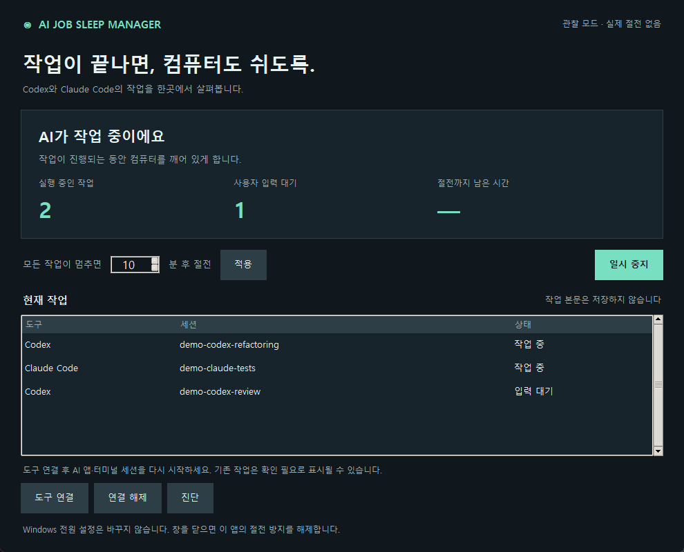
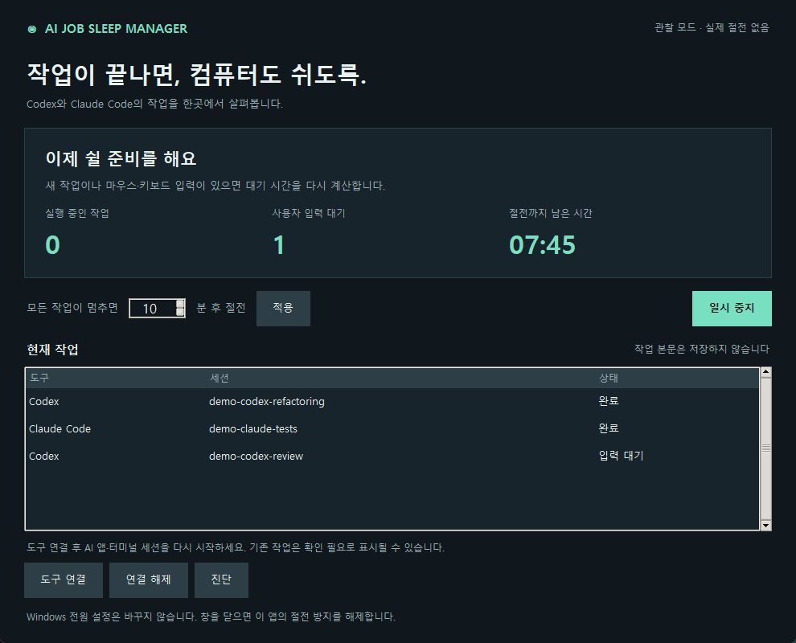
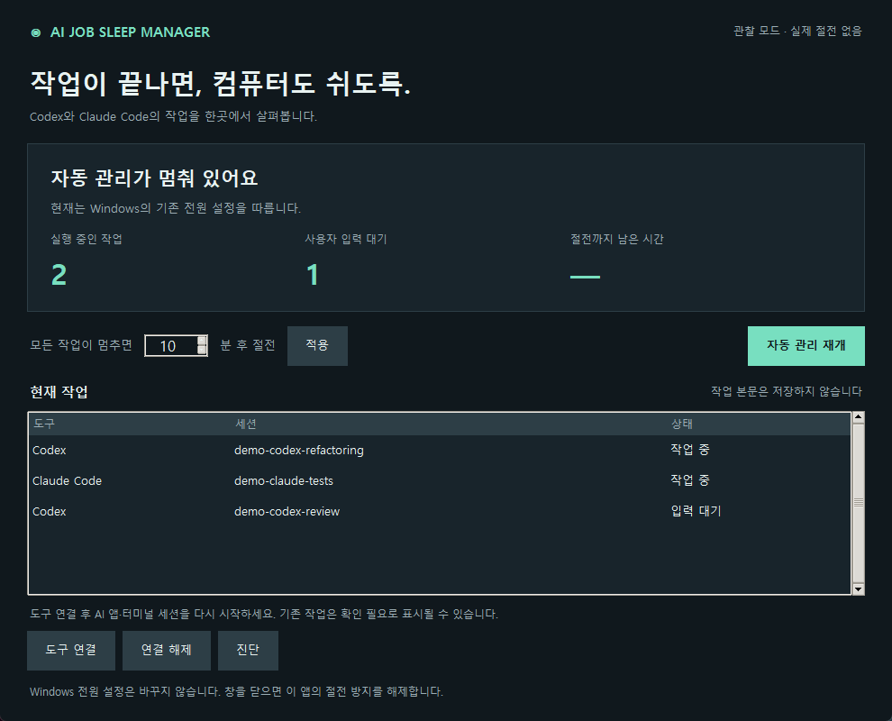
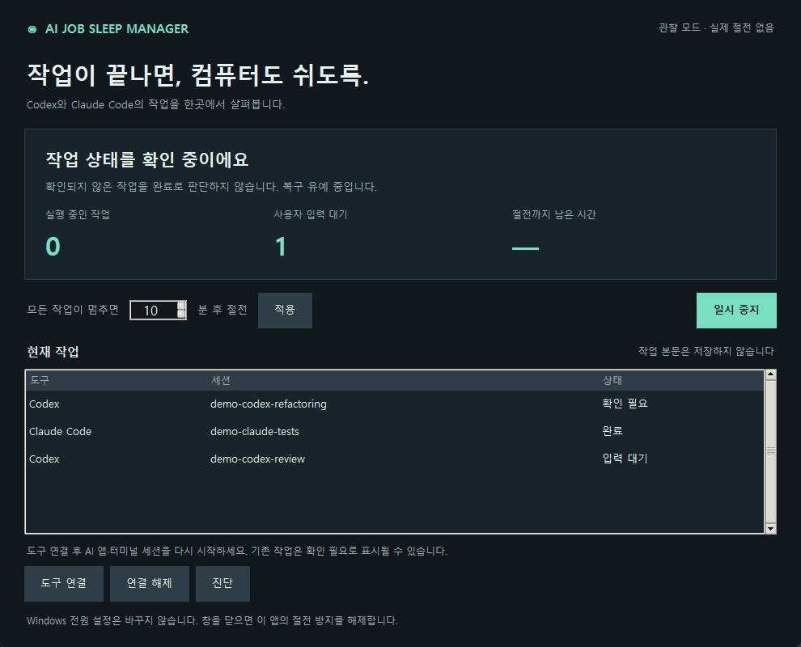

# AI Job Sleep Manager

**AI가 일하는 동안 PC를 깨어 있게 하고, 작업이 끝나면 설정한 시간 후 절전을 요청하는 Windows 앱입니다.**

Codex와 Claude Code에 긴 개발 작업을 맡긴 채 자리를 비우는 사용자를 위해 만들었습니다. 앱 창이 열려 있는지보다 **실제로 실행 중인 작업이 있는지**를 기준으로 절전을 관리합니다.

> **개발 상태: 초기 구현 / 실사용 검증 진행 중**
> 자동 테스트 66개와 Windows 절전 방지 요청의 설정·해제를 확인했습니다. 실제 작업 완료부터 PC 절전·복귀까지 이어지는 전체 과정과 네 가지 대상 환경의 모든 시나리오는 아직 검증되지 않았습니다. 현재 버전을 검증이 끝난 야간 무인 운영용 제품으로 보지는 않습니다.



*실제 프로그램 UI를 관찰 모드에서 촬영한 화면입니다. `demo-` 세션은 기능 설명용 예시 데이터이며, 실제 AI 작업 수행이나 절전 성공을 증명하는 화면은 아닙니다. 아래 화면도 같은 방식으로 촬영했습니다.*

## 목차

- [어떤 문제를 해결하나요?](#어떤-문제를-해결하나요)
- [핵심 기능](#핵심-기능)
- [대상 환경과 현재 지원 상태](#대상-환경과-현재-지원-상태)
- [빠른 시작](#빠른-시작)
- [처음 연결하고 사용하는 순서](#처음-연결하고-사용하는-순서)
- [동작 규칙](#동작-규칙)
- [데이터와 설정](#데이터와-설정)
- [문제 해결](#문제-해결)
- [개발 및 실행 파일 빌드](#개발-및-실행-파일-빌드)
- [검증 현황과 알려진 한계](#검증-현황과-알려진-한계)
- [프로젝트 구조](#프로젝트-구조)

## 어떤 문제를 해결하나요?

장시간 AI 작업을 맡길 때 일반적인 전원 설정만으로는 두 가지 문제가 생깁니다.

| 상황 | 겪는 문제 | 이 프로그램의 접근 |
| --- | --- | --- |
| Windows 자동 절전 사용 | 자리를 비우면 개발 작업 도중 PC가 절전될 수 있음 | 실행 중인 작업을 감지한 동안 시스템 자동 절전 방지 |
| AI 앱의 상시 절전 방지 사용 | 작업이 끝나도 앱이 열려 있으면 PC가 계속 켜질 수 있음 | 모든 작업이 완료·입력 대기가 되면 설정 시간 후 절전 요청 |
| 여러 창·터미널에서 동시 작업 | 어느 작업이 아직 실행 중인지 일일이 확인해야 함 | 관측된 Codex·Claude Code 작업 상태를 한 화면에서 집계 |

예를 들어 Codex의 리팩터링과 Claude Code의 테스트를 동시에 실행하면, 한쪽이 끝나도 다른 작업이 실행 중인 동안 보호합니다. 마지막 실행 작업이 끝나면 사용자가 정한 대기 시간을 세기 시작합니다.

이 앱은 AI 작업을 실행하거나 승인하지 않습니다. 작업 지시, 권한 승인, 배포 여부는 기존 AI 도구에서 결정합니다.

## 핵심 기능

### 1. 작업 상태 대시보드와 실행 중 절전 방지

상단 카드에서 실행 중인 작업 수, 사용자 입력 대기 수, 절전까지 남은 시간을 확인할 수 있습니다. 아래 목록에는 도구, 세션 식별자, 현재 상태가 표시됩니다.

- 관측된 작업 중 하나라도 실행 중이면 시스템 자동 절전을 방지합니다.
- 지원 이벤트로 확인한 하위 작업도 상태 판단에 반영합니다.
- 입력 대기 작업이 있어도 다른 작업이 실행 중이면 카운트다운을 시작하지 않습니다.
- 화면 꺼짐은 허용합니다. 모니터를 계속 켜 두는 프로그램은 아닙니다.

메인 화면의 예시는 **2개 실행 + 1개 입력 대기**이므로 절전 대기가 시작되지 않은 상태입니다.

### 2. 완료·입력 대기 후 설정 시간에 절전

화면의 **모든 작업이 멈추면 [숫자] 분 후 절전**에서 시간을 지정하고 **적용**을 누릅니다.

| 항목 | 동작 |
| --- | --- |
| 기본 대기 시간 | 10분 |
| 설정 범위 | 1~120분, UI에서 정수 입력 |
| 카운트다운 시작 | 실행 작업이 없고 나머지 상태가 완료·입력 대기 등으로 확인된 경우 |
| 대기 중 새 작업·작업 재개 | 절전 예약 취소, 작업 보호로 전환 |
| 대기 중 마우스·키보드 입력 | 마지막 입력 시점부터 설정 시간 전체를 다시 계산 |
| 대기 중 시간 설정 변경 | 적용 시점부터 새 대기 시간 계산 |



*실행 중인 작업이 0개가 되어 절전 대기 중인 예시입니다. 사람이 답해야 하는 상태로 확인된 작업은 절전 대기 대상에 포함됩니다.*

설정한 시간이 지나기 전 Windows가 자동 절전하지 않도록 카운트다운 중에도 보호합니다. 만료 직전에 새 작업과 사용자 입력을 다시 확인하고, 외부 전원 요청·권한에 문제가 없을 때 절전을 요청합니다.

### 3. 자동 관리 일시 중지·재개

**일시 중지**를 누르면 예약과 이 앱의 절전 방지 요청을 해제합니다. 이후에는 Windows의 기존 전원 정책을 따릅니다. 다시 **자동 관리 재개**를 누르면 작업 상태에 따른 관리로 돌아갑니다.



- 일시 중지는 AI 작업 자체를 멈추는 기능이 아닙니다.
- 중지 여부는 저장되므로 앱을 다시 실행해도 유지됩니다.
- 창을 최소화하면 관리를 계속합니다.
- 창을 닫으면 이 앱의 절전 방지를 해제하고 종료합니다.
- 현재 시스템 트레이 상주나 Windows 로그인 시 자동 실행 기능은 없습니다.

### 4. 감지 불확실성과 절전 보류 표시

연결이 끊기거나 작업 종료를 판단할 증거가 부족하면 **확인 필요** 상태를 표시합니다.



다른 실행 작업이 없는 상태에서 불확실성이 계속되면 기본 30분 동안 복구를 기다립니다. 유예가 지나면 자체 절전 요청 없이 이 앱의 보호를 해제하고 Windows 정책을 따릅니다. 따라서 이 상태에서는 진행 중 작업 보호가 보장되지 않으며, Windows가 절전 안 함으로 설정되어 있으면 PC가 계속 켜질 수 있습니다.

다른 앱이 절전을 막거나 전원 요청 목록 조회에 실패하면 절전을 보류하고 약 30초 간격으로 다시 확인합니다. 이유는 **진단**에서 확인할 수 있습니다.

### 5. 도구 연결·해제와 진단

화면 하단 버튼으로 연결을 관리합니다.

| 버튼 | 기능 |
| --- | --- |
| **도구 연결** | 기존 설정을 백업한 뒤 Codex·Claude Code 관측용 hooks 추가 |
| **연결 해제** | 현재 실행 경로와 일치하는 관측용 hooks 제거 및 자동 관리 중지 |
| **진단** | 전원 기능, 관리자 여부, 최근 이벤트, 감지 상태, 오류 및 데이터 위치 표시 |
| **관리자 권한으로 열기** | 현재 앱을 닫고 같은 데이터 위치로 관리자 재실행. 일반 실행 모드에서 비관리자일 때 표시 |

설정 저장 성공과 실제 연결 성공은 다릅니다. **도구 연결 후 새로운 AI 작업의 이벤트가 수신되는지** 확인해야 합니다.

## 대상 환경과 현재 지원 상태

대상은 **Windows 네이티브 환경에서 실행되는 로컬 AI 개발 작업**입니다.

| 대상 환경 | 구현 접근 | 현재 검증 상태 |
| --- | --- | --- |
| Codex 데스크톱 앱 | hooks와 로컬 세션 생애주기 기록 관측 | 실행 중 작업 관측 확인. 전체 완료·대기·재개 흐름 미검증 |
| Claude 데스크톱 앱의 Claude Code | Claude Code hooks | 실제 데스크톱 전체 흐름 미검증 |
| VS Code 터미널의 Codex CLI | hooks와 로컬 세션 기록 관측 | 별도 CLI 생애주기 관측. 모델·CLI 버전 문제로 정상 완료 미검증 |
| VS Code 터미널의 Claude Code | Claude Code hooks | 별도 CLI 시작·실패·종료 수신 확인. 정상 완료 및 VS Code 내 전체 흐름 미검증 |

일반 Claude 채팅, Cowork, 브라우저 채팅, 원격 머신, WSL은 현재 자동 연결 대상이 아닙니다. 위 네 환경도 **지원 목표와 어댑터 구현 범위**이며, 모두 검증이 끝났다는 의미가 아닙니다.

## 빠른 시작

### 준비물

- Windows PC와 해당 PC에서 실행되는 Codex 또는 Claude Code.
- 소스 실행: **Python 3.10 이상과 Tkinter**. Windows용 Python 설치 시 Tcl/Tk 지원이 포함되어 있어야 합니다.
- 저장소를 내려받으려면 Git 또는 GitHub의 **Code → Download ZIP** 사용.
- 앱 자체에는 별도 AI API 키나 서버 계정이 필요하지 않습니다. AI 도구의 로그인·사용량은 각 도구에서 관리합니다.

### 소스에서 먼저 관찰 모드로 실행

PowerShell에서 실행합니다.

```powershell
git clone https://github.com/zxcc9867/ai-job-sleep-manager.git
cd ai-job-sleep-manager
python app.py --dry-run
```

저장소가 비공개이면 접근 가능한 GitHub 계정으로 인증해야 합니다. ZIP으로 내려받았다면 압축을 풀고 해당 폴더에서 마지막 명령을 실행합니다.

`--dry-run`은 **절전 방지 요청과 실제 절전을 수행하지 않습니다.** 화면 상단의 `관찰 모드 · 실제 절전 없음` 표시를 확인하세요. 관찰 모드는 기존 Windows 자동 절전도 막지 않습니다. **도구 연결** 버튼은 관찰 모드에서도 실제 설정 파일을 수정합니다.

런타임 외부 Python 패키지는 필요하지 않습니다. `python -m tkinter`로 Tkinter 설치 여부를 확인할 수 있습니다.

### 일반 실행

관찰 모드 창을 닫은 뒤 실행합니다.

```powershell
python app.py
```

또는 `launch.cmd`를 더블클릭합니다. `launch.cmd`는 빌드된 실행 파일이 있으면 그것을 실행하고, 없으면 소스 앱을 실행합니다.

**Git 저장소에는 실행 파일과 Python 번들을 포함하지 않습니다.** Python 설치 없이 사용할 폴더형 실행 파일은 [빌드 절차](#개발-및-실행-파일-빌드)로 만들 수 있습니다. 현재 설치 프로그램이나 GitHub Release 다운로드는 제공하지 않습니다.

## 처음 연결하고 사용하는 순서

1. **설치 위치를 먼저 정합니다.** 연결 설정에는 실행 파일 또는 소스의 경로가 들어갑니다.
2. **관찰 모드로 시작합니다.** 기존 자동 관리를 실행 중이었다면 창을 닫고 모드를 바꿉니다. 동일 데이터 폴더를 사용하는 앱은 중복 실행되지 않습니다.
3. **도구 연결**을 누릅니다. 두 도구의 기본 사용자 설정에 관측용 hooks를 추가하며 기존 설정은 보존합니다.
4. **Codex·Claude 앱 및 터미널의 AI 세션을 재시작합니다.** 도구가 요구하는 hook 신뢰 검토를 완료합니다. 연결 전부터 실행 중인 세션은 이벤트가 누락될 수 있습니다.
5. **짧은 작업을 실행하고 목록과 진단을 확인합니다.** 작업을 시작했을 때 실행 상태가 나타나는지, 완료나 사용자 입력 대기가 올바르게 반영되는지 확인합니다. 계정 또는 CLI 오류가 있으면 먼저 해당 도구에서 해결합니다.
6. **대기 시간을 설정하고 적용합니다.** 최초에는 짧은 시간으로 동작을 확인한 뒤 평소 사용할 값으로 바꿉니다.
7. **일반 실행으로 전환합니다.** 관찰 모드 창을 닫고 `python app.py` 또는 실행 파일을 인수 없이 실행합니다.
8. **필요한 전원 권한을 확인합니다.** 진단에서 권한 문제가 보이면 일반 실행 창의 **관리자 권한으로 열기**를 사용합니다. 권한 승인 후 앱이 다시 열립니다.
9. **기존 상시 절전 방지와 충돌을 확인합니다.** AI 앱 등의 상시 절전 방지가 켜져 있으면 이 앱이 절전을 보류할 수 있습니다. 작업 감지가 확인된 뒤 기존 옵션을 조정하세요.
10. **평소처럼 AI 도구에서 작업합니다.** 관리 앱은 켜 두거나 작업 표시줄로 최소화합니다. 실제 절전·복귀는 직접 확인할 수 있는 상황에서 먼저 검증하세요.

연결과 절전 관리가 시작되어도 기존 AI 작업의 승인 정책이나 배포 설정은 바뀌지 않습니다.

## 동작 규칙

| 현재 상황 | 앱 동작 |
| --- | --- |
| 처음 실행했고 관측된 작업이 없음 | 작업 대기. 자체 카운트다운을 시작하지 않음 |
| 실행 중인 작업이 하나 이상 있음 | 시스템 자동 절전 방지 |
| 모든 작업이 완료·입력 대기이고 상태가 확인됨 | 설정한 시간만큼 대기한 뒤 절전 요청 |
| 카운트다운 중 새 작업·재개 | 예약 취소 및 작업 보호 |
| 카운트다운 중 사용자 입력 | 대기 시간 초기화 |
| 완료 증거가 부족함 | 확인 필요 표시 및 복구 유예 |
| 외부 절전 방지·권한 오류 | 절전 보류 및 주기적 재확인 |
| 일시 중지·앱 종료 | 이 앱 소유의 절전 방지 해제 |
| 절전에서 복귀 | 기존 만료 카운트다운을 그대로 실행하지 않고 다시 계산 |

**완료는 작업 이벤트의 종료를 뜻합니다.** 코드 품질, 테스트 성공, 프로젝트 목표 달성 여부를 판정하지 않습니다. 실패·취소도 작업 실행이 끝났다는 증거가 충분한 경우 완료 상태로 정리될 수 있습니다.

권한 요청 이벤트가 발생했다고 무조건 입력 대기로 처리하지는 않습니다. 자동 승인될 요청과 사람이 응답해야 하는 대기를 구분할 증거가 부족하면 확인 필요로 취급합니다.

## 데이터와 설정

| 항목 | 위치 또는 내용 |
| --- | --- |
| 로컬 데이터 | `%LOCALAPPDATA%\AIJobSleepManager\events.sqlite3` |
| 저장하는 정보 | 도구, 세션·턴·하위 작업 식별자, 상태 이벤트, 시각, 관리 설정 |
| 저장하지 않는 정보 | 프롬프트 본문, 소스코드 본문, AI 응답 본문, 키보드 입력 내용 |
| Claude 연결 설정 | `%USERPROFILE%\.claude\settings.json` |
| Codex 연결 설정 | `%USERPROFILE%\.codex\hooks.json` |
| 설정 백업 | 각 설정 파일 옆에 고유 이름으로 생성, 개인 사용자 권한 적용 |

Codex의 로컬 세션 기록에서 상태 필드를 읽지만 작업 본문을 앱 데이터에 복사하거나 외부 서버로 전송하지 않습니다. 데이터는 서버 없이 로컬 SQLite에 저장합니다. 앱이 추가하는 hooks는 AI 출력에 지시를 삽입하지 않습니다.

자동 연결은 기본 사용자 경로를 대상으로 합니다. `CODEX_HOME` 또는 `CLAUDE_CONFIG_DIR`가 설정되어 있으면 UI가 자동 연결을 중단합니다. 사용자 지정 경로의 수동 연결 절차는 아직 제공하지 않습니다.

### 이동·연결 해제·삭제

1. 현재 위치에서 앱의 **연결 해제**를 누릅니다.
2. AI 앱과 세션을 재시작합니다.
3. 관리 앱을 닫습니다.
4. 프로그램을 옮긴 경우 새 위치에서 **도구 연결**을 다시 수행합니다.

폴더형 실행 파일은 `AIJobSleepManager.exe`, `AIJobSleepHook.exe`, `_internal`을 포함한 **폴더 전체**를 옮겨야 합니다. 앱이 생성한 로컬 데이터와 설정 백업은 프로그램 폴더를 삭제해도 남습니다. 필요 없을 때 별도로 정리하세요. 원래 AI 설정 파일 전체를 삭제할 필요는 없습니다.

## 문제 해결

| 증상 | 확인할 내용 |
| --- | --- |
| 작업이 목록에 나타나지 않음 | 도구 연결 후 AI 앱·세션을 다시 시작했는지, hook 신뢰 검토를 했는지, 기본 설정 경로를 사용하는지 확인 |
| 앱을 켜도 절전 방지가 되지 않음 | 관찰 모드인지, 일시 중지 상태인지, 실제 작업 이벤트가 들어오는지 확인 |
| AI 앱이 열려 있는데 작업 대기 또는 확인 필요로 표시됨 | 열린 앱과 실행 중인 작업은 다름. 진단의 최근 이벤트와 연결 상태 확인 |
| 작업이 끝났는데 확인 필요가 남음 | 종료 증거, 하위 작업 상태, 도구 버전 또는 연결 문제 확인. 불명 상태를 강제로 완료로 간주하지 않음 |
| 카운트다운이 계속 처음으로 돌아감 | 새 작업 또는 마우스·키보드 입력이 들어오는지 확인 |
| 절전을 보류했다고 표시됨 | 진단의 `last_error`, 관리자 여부, 다른 앱의 전원 요청 확인 |
| 관리자 권한 버튼이 보이지 않음 | 관찰 모드이거나 이미 관리자 권한으로 실행 중이면 표시되지 않음 |
| 다시 실행했는데 자동 관리가 멈춰 있음 | 이전에 일시 중지한 설정이 저장됨. 자동 관리 재개 선택 |
| 이미 실행 중이라는 메시지 | 작업 표시줄의 기존 창을 확인. 모드를 바꾸려면 기존 창을 닫고 재실행 |
| 프로그램을 옮긴 뒤 감지가 안 됨 | 기존 실행 경로의 hooks가 남아 있을 수 있음. 이동 전 연결 해제, 이동 후 다시 연결 필요 |

PowerShell에서 읽기 전용 진단을 실행할 수 있습니다.

```powershell
python app.py --diagnose
```

Windows의 절전 지원 방식과 현재 전원 요청은 다음 명령으로 확인합니다. 전원 요청 조회는 관리자 PowerShell이 필요할 수 있습니다.

```powershell
powercfg /a
powercfg /requests
```

관측만 하는 CLI 실행 예시입니다. 최대 60초까지 실행되며 `--dry-run`을 함께 사용해야 전원 요청이 발생하지 않습니다.

```powershell
python app.py --dry-run --observe-seconds 10
```

## 개발 및 실행 파일 빌드

### 자동 테스트

프로젝트 루트에서 실행합니다. 테스트는 실제 PC 절전을 수행하지 않습니다.

```powershell
python -m unittest discover -s tests -v
python -m compileall -q app.py sleep_manager scripts
```

상태 정책, 중복·역순 이벤트, 하위 작업, 타이머, SQLite, hooks 설정 보존 및 전원 제어 경계 등을 확인합니다. 별도 린터나 정적 타입 검사 설정은 현재 없습니다.

### Windows 실행 파일 만들기

```powershell
.\build.ps1
```

스크립트는 프로젝트의 `.build-env`에 빌드 환경을 만들고 `requirements-build.txt`의 **PyInstaller 6.22.3**을 설치한 뒤 패키징합니다. 빌드 의존성 다운로드에는 네트워크가 필요합니다.

결과:

```text
dist/AIJobSleepManager/
├── AIJobSleepManager.exe   # GUI 앱
├── AIJobSleepHook.exe      # AI hooks의 stdin을 읽는 보조 프로그램
└── _internal/             # Python과 GUI 런타임 등
```

빌드된 앱은 Python을 별도로 설치하지 않고 실행할 수 있습니다. 실행 파일은 코드 서명되어 있지 않으며, 현재 자동 업데이트·설치 프로그램은 없습니다.

```powershell
.\dist\AIJobSleepManager\AIJobSleepManager.exe --dry-run
```

### 문서 스크린샷 다시 촬영

Windows의 보이는 데스크톱에서 다음을 실행합니다. Pillow는 촬영 도구에만 필요합니다.

```powershell
python -m venv .docs-env
.\.docs-env\Scripts\python.exe -m pip install Pillow
.\.docs-env\Scripts\python.exe scripts\capture_screenshots.py
```

실제 UI와 상태 엔진에 예시 이벤트를 전달해 `docs/images/`의 네 화면을 촬영합니다. 임시 데이터 폴더와 대체 전원·로그 입력을 사용하므로 사용자 AI 설정, 실제 작업 기록, 전원 상태를 변경하지 않습니다. 창이 잠시 앞으로 나타납니다.

## 검증 현황과 알려진 한계

검증 기준일: **2026-09-13**. 아래 표는 자동 테스트와 실제 환경 확인 결과를 구분한 기록입니다.

| 검증 항목 | 결과 |
| --- | --- |
| 자동 테스트 | 66개 통과 |
| 소스 구문 컴파일 | 통과 |
| PyInstaller 폴더형 빌드 | 통과 |
| 패키징된 GUI 시작·종료 | 관찰 모드 확인 |
| 패키징된 Hook의 stdin 수신·무출력·본문 제거 | 확인 |
| Windows 보호 요청 생성·설정·해제·닫기 | 실제 API 확인. 절전 호출 제외 |
| Codex 데스크톱 실행 상태 | 실제 로컬 기록 관측 |
| Codex CLI 0.139.0 | 생애주기 관측. 설정 모델이 최신 CLI를 요구해 정상 작업 검증 미완료 |
| Claude Code 2.1.259 | 시작·실패·종료 hooks 수신. 크레딧 부족으로 정상 작업 검증 미완료 |
| 네 환경의 정상 완료·입력 대기·재개 전체 흐름 | 미완료 |
| 실제 PC 절전·복귀 / 야간 3회 운영 | 미실시 |

알려진 한계:

- Codex 로컬 로그는 비공식이며 버전에 따라 형식이 바뀔 수 있습니다. Stop hook만으로 완료를 확정하지 않습니다.
- Claude의 Stop은 다른 hook이 작업을 재진행시키기 전의 후보 신호일 수 있습니다. 모든 후속 실행의 최종 상태를 관측하는 것은 아닙니다.
- 장시간 백그라운드 명령, 영구 실행 서버, 누락된 하위 작업과 모든 세션의 완전한 발견은 검증되지 않았습니다.
- 프로세스 이름은 보조 확인에만 사용합니다. 모든 작업을 찾았다는 증거가 아닙니다.
- 절전 직전 다시 확인하더라도 이벤트 수신과 Windows 전환을 완전히 동시에 처리할 수는 없습니다.
- 수동 절전, 노트북 덮개 닫기, 배터리 부족, Modern Standby의 배터리 전원 등은 별도 OS 정책·제약을 따릅니다.
- 영상 재생·다운로드처럼 키보드 입력 없이 PC를 사용하는 모든 상황을 별도로 감지하지 않습니다. 다른 앱의 전원 요청 확인에 의존합니다.
- 앱을 닫거나 관리를 중지해도 다른 프로그램이 보유한 절전 방지 요청은 해제하지 않습니다.

## 프로젝트 구조

```text
app.py                       # GUI·hook·진단·관찰 진입점
sleep_manager/
  engine.py                  # 상태 집계와 타이머 정책
  controller.py              # 이벤트 수신과 절전 직전 재확인
  integrations.py            # hooks 정규화 및 연결 설정
  codex_logs.py              # Codex 로컬 생애주기 관측
  storage.py                 # 로컬 SQLite 이벤트와 설정
  power.py                   # Windows 전원·입력 API
  ui.py                      # Tkinter UI
scripts/capture_screenshots.py
  # 예시 데이터로 실제 UI 촬영
tests/                       # 자동 테스트
docs/images/                 # README 화면
build.ps1                    # Windows 패키징
AIJobSleepManager.spec       # PyInstaller 구성
launch.cmd                   # 실행 도우미
```

구조는 `AI 이벤트 → 로컬 큐·로그 관측 → 상태 엔진 → Windows 전원 제어`로 나뉩니다. UI는 상태를 보여 주며 정책은 별도 엔진에서 처리합니다.
